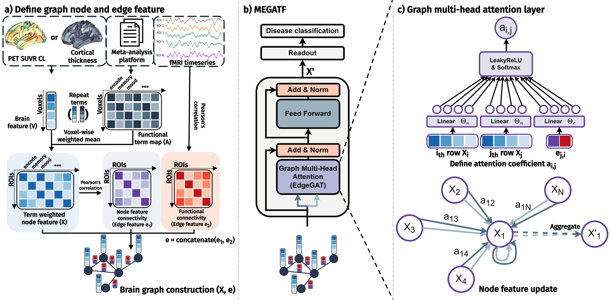

# Integrating meta-analysis in multi-modal brain studies with graph-based attention transformer

Official page of "Integrating meta-analysis in multi-modal brain studies with graph-based attention transformer" (MICCAI 2025)

[Paper](https://papers.miccai.org/miccai-2025/0455-Paper2372.html)

# Abstract
Multi-modal neuroimaging studies are essential for exploring various brain disorders; however, they are typically limited in sample size owing to the cost of image acquisition. Meta-analysis is an underutilized method that integrates the findings from multiple studies derived from large samples to assist individual studies. Neuroimaging studies are increasingly adopting transformer architecture for network analysis; however, they tend to overlook local brain networks. To address these gaps, we propose the Meta-analysis Enhanced Graph Attention TransFormer (MEGATF), a novel method for performing multimodal brain analysis built on a graph transformer framework aided with meta-analysis information derived from NeuroSynth. Our method adapts a graph neural network with a transformer attention mechanism that favors local networks and multimodal interactions using PET or cortical thickness. Our method achieved a state-of-the-art classification performance on mild cognitive impairment and attention-deficit/hyperactivity disorder datasets, distinguishing individuals with brain disorders from controls. Furthermore, it identified disease-affected brain regions and associated cognitive decoding that aligned with existing findings, thereby enhancing its interpretability.
